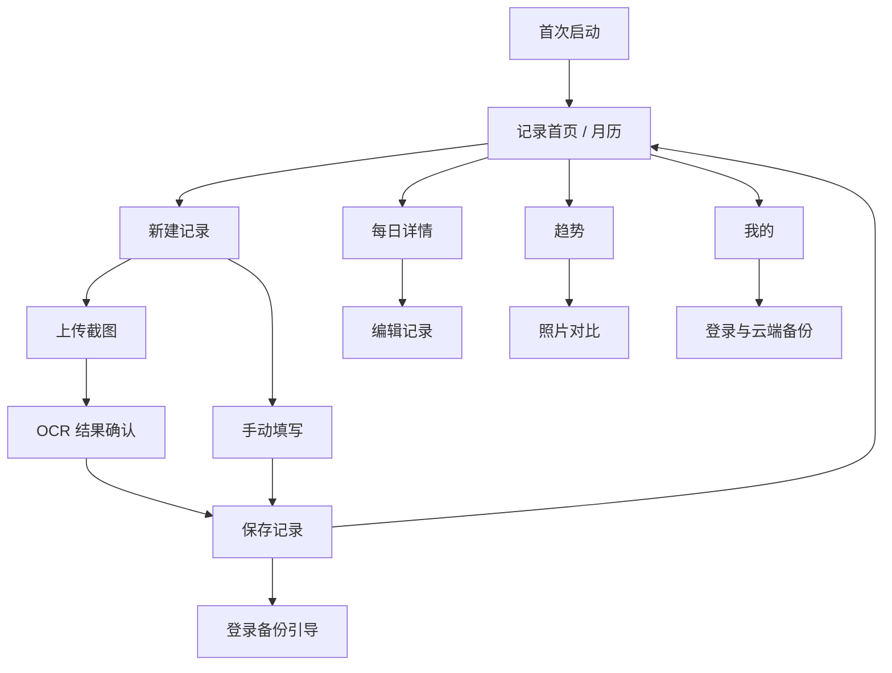

# 轻体记 MVP 低保真页面说明

## 1. 页面地图



## 2. 首次启动

```text
┌────────────────────────────┐
│                            │
│          轻体记             │
│   用一分钟记录身体的变化     │
│                            │
│  体重单位                   │
│  [ 公斤 ● ]   [ 斤 ○ ]      │
│                            │
│  身高（选填）               │
│  [ 165                 cm ] │
│                            │
│  目标体重（选填）            │
│  [ 55                  kg ] │
│                            │
│  [       开始记录       ]   │
│                            │
│  无需登录，数据默认保存在本机 │
└────────────────────────────┘
```

交互说明：

- 默认使用雾樱主题。
- 不展示主题选择，不要求登录。
- 点击开始记录后直接进入月历首页。

## 3. 记录首页 / 月历

```text
┌────────────────────────────┐
│  轻体记                 ◐   │
│                            │
│  当前体重                  │
│  59.6 kg     较首次 -1.4 kg │
│  连续记录 6 天              │
│                            │
│      ‹      2026年8月    ›  │
│  一   二   三   四   五  六  日│
│                 1    2     │
│                59.6  ·     │
│  3    4    5    6    7  8  9│
│ 59.4      59.1📷            │
│ 10   11   12   13   14 15 16│
│           58.9              │
│                            │
│  8月12日 · 晨起空腹          │
│  体重 58.9 kg   体脂 26.4%   │
│  [      查看当天记录      ]  │
│                            │
│          [ ＋ 记录 ]        │
│                            │
│  记录         趋势         我的│
└────────────────────────────┘
```

交互说明：

- 右上角 `◐` 表示主题切换，实际使用月亮或太阳图标。
- 晨起空腹记录直接显示体重数字。
- 非空腹记录仅显示灰色圆点。
- 有体型照片的日期显示小照片角标。
- 点击日期更新下方摘要，点击摘要进入详情。
- 点击记录按钮默认使用当前选中日期。

## 4. 新建记录方式

```text
┌────────────────────────────┐
│  ×        记录 8月12日       │
│                            │
│  选择一种更方便的记录方式     │
│                            │
│  ┌──────────────────────┐  │
│  │  ▣ 上传体脂秤截图       │  │
│  │  自动识别体重和身体数据  │  │
│  └──────────────────────┘  │
│                            │
│  ┌──────────────────────┐  │
│  │  ✎ 手动填写            │  │
│  │  只填写体重也可以       │  │
│  └──────────────────────┘  │
└────────────────────────────┘
```

## 5. OCR 处理中

```text
┌────────────────────────────┐
│  ‹       正在识别            │
│                            │
│       [ 截图缩略图 ]         │
│                            │
│       正在读取身体数据…       │
│       ━━━━━━━━━━━           │
│                            │
│  通常只需要几秒              │
└────────────────────────────┘
```

异常说明：

- 识别失败后保留截图，并提供“重新识别”和“手动填写”。
- 用户离开页面前提示识别结果尚未保存。

## 6. OCR 结果确认

```text
┌────────────────────────────┐
│  ‹       确认识别结果        │
│                            │
│  日期       [ 2026-08-12 › ] │
│  晨起空腹   [      ●      ]  │
│  起床、如厕后，进食饮水前测量 │
│                            │
│  核心数据                   │
│  体重       [ 59.62    kg ] │
│  体脂率     [ 27         % ] │
│  BMI        [ 21.1         ] │
│  肌肉量     [ 40.7     kg ] │
│                            │
│  [ 展开其他 15 项身体数据  ∨ ]│
│                            │
│  体型照片                  ＋ │
│  备注（选填）                │
│                            │
│  [        确认保存        ]  │
└────────────────────────────┘
```

交互说明：

- 日期与晨起空腹状态必须由用户确认。
- 低置信度字段使用浅色警示边框，但不阻塞其他字段编辑。
- 体重缺失时主按钮不可用。
- 点击任何数值即可直接编辑。

## 7. 手动填写

```text
┌────────────────────────────┐
│  ‹         手动记录          │
│                            │
│  日期       [ 2026-08-12 › ] │
│  晨起空腹   [      ●      ]  │
│                            │
│  体重       [          kg ]  │
│  体脂率     [           % ]  │
│  BMI        [             ]  │
│  肌肉量     [          kg ]  │
│                            │
│  [ 添加更多身体数据       ＋ ] │
│                            │
│  体型照片                  ＋ │
│  备注（选填）                │
│                            │
│  [          保存          ]  │
└────────────────────────────┘
```

## 8. 首次保存后的登录引导

```text
┌────────────────────────────┐
│             ✓              │
│        今日记录成功          │
│                            │
│  59.6 已显示在你的日历中      │
│                            │
│  登录后可安全备份身体数据，    │
│  更换手机也不会丢失。         │
│                            │
│  [       登录并备份       ]  │
│       稍后再说               │
└────────────────────────────┘
```

交互说明：

- 引导只在首次保存后自动出现一次。
- 用户选择稍后再说后，记录不会丢失，返回月历。
- “我的”页持续展示非打扰式备份入口。

## 9. 每日详情

```text
┌────────────────────────────┐
│  ‹       2026年8月12日   ··· │
│          晨起空腹            │
│                            │
│  体重          体脂率        │
│  59.6 kg       27.0%        │
│                            │
│  BMI 21.1      肌肉量 40.7kg │
│  [ 查看全部身体数据       › ] │
│                            │
│  今日体型                   │
│  ┌──────────────────────┐  │
│  │                      │  │
│  │       体型照片         │  │
│  │                      │  │
│  └──────────────────────┘  │
│                            │
│  原始体脂秤截图           ›  │
│  备注：今天状态不错          │
└────────────────────────────┘
```

## 10. 趋势页

```text
┌────────────────────────────┐
│  趋势                  ◐    │
│                            │
│  [ 7天 ] [ 30天 ] [ 全部 ]  │
│                            │
│  体重变化                   │
│  当前 59.6 kg    -1.4 kg    │
│       ╲__                    │
│          ╲_╱╲__             │
│                ╲            │
│                            │
│  体脂率变化                 │
│  当前 27.0%      -0.8%      │
│       ╲___╱╲___             │
│                            │
│  [       对比体型照片      ] │
│                            │
│  记录         趋势         我的│
└────────────────────────────┘
```

## 11. 照片对比

```text
┌────────────────────────────┐
│  ‹        体型对比           │
│                            │
│  [ 7月1日  ∨ ] [ 8月1日  ∨ ] │
│                            │
│  ┌──────────┐ ┌──────────┐ │
│  │          │ │          │ │
│  │  7月1日   │ │  8月1日   │ │
│  │  照片     │ │  照片     │ │
│  │          │ │          │ │
│  └──────────┘ └──────────┘ │
│                            │
│          相隔 31 天          │
│   体重 -2.4 kg  体脂 -1.2%   │
└────────────────────────────┘
```

交互说明：

- 日期选择器只展示已有照片的日期。
- 两张照片使用相同容器比例和裁剪方式。
- 默认不提供公开分享按钮。

## 12. 我的

```text
┌────────────────────────────┐
│  我的                  ◐    │
│                            │
│  游客用户                   │
│  [      登录并开启备份     ] │
│                            │
│  个人资料                 ›  │
│  体重单位             公斤 ›  │
│  外观主题             雾樱 ›  │
│  云端备份             未开启  │
│  隐私与数据管理           ›  │
│  关于轻体记               ›  │
│                            │
│  记录         趋势         我的│
└────────────────────────────┘
```

## 13. 主题一键切换

```text
雾樱主题：首页右上角显示月亮
        点击一次
           ↓
曜石主题：首页右上角显示太阳
        点击一次
           ↓
返回雾樱主题
```

状态规则：

- 不打开弹窗或抽屉。
- 不跳转独立页面。
- 切换过程使用短暂颜色过渡。
- 当前页面、选中日期、滚动位置保持不变。
- 切换结果持久化。
- 图标需要提供无障碍名称，例如“切换至曜石主题”。

## 14. 关键空状态

### 14.1 尚无记录

```text
这个月还没有身体记录
从今天的体重开始，不必一次填完所有数据。
[ 记录今天 ]
```

### 14.2 尚无趋势

```text
至少完成两次晨起空腹记录后，才能看到变化趋势。
[ 去记录 ]
```

### 14.3 尚无照片对比

```text
需要至少两个日期的体型照片才能进行对比。
[ 添加今天的照片 ]
```

## 15. 原型验证重点

第一轮用户测试只验证：

1. 用户能否理解月历中的体重数字代表晨起空腹记录。
2. 用户能否在一分钟内完成截图上传与确认。
3. 用户是否知道日期和空腹状态需要自行确认。
4. 用户能否找到照片对比入口。
5. 用户是否理解月亮按钮用于主题切换。
6. 登录引导是否会打断首次成功体验。
